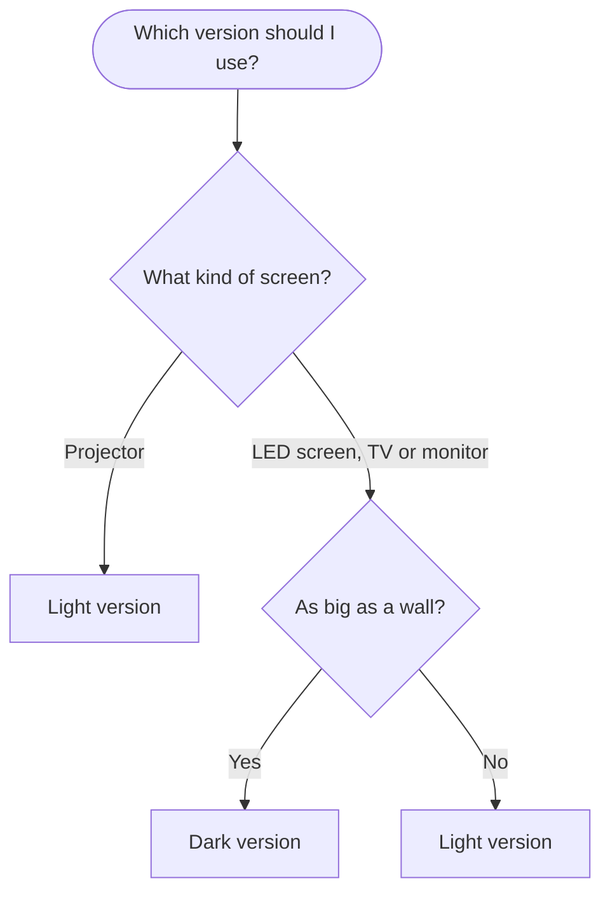

# Python Brasil 2026 slide template

[Português](README.md) · English · [Español](README.es.md)

A ready-to-use presentation template for speakers at [Python Brasil 2026](https://2026.pythonbrasil.org.br/), in Florianópolis, from October 14 to 19. Open it, replace the example text with yours, and present. The example slides and the speaker notes are in Portuguese.

## Choose how you will edit

| You use | Do this |
|---|---|
| Google Slides | **[Make a copy in Google Slides](https://docs.google.com/presentation/d/1HGcC2Lbf8BHAgGclem_B59hNk6GgIViRhIFLfi1WFww/copy)**. The copy goes to your Google Drive. |
| PowerPoint or Keynote | Download the [`.pptx`](https://github.com/rodbv/pybr2026-slides/releases/latest/download/pybr2026-template.pptx) and [install the fonts](#frequently-asked-questions). |
| LibreOffice | Download the [`.odp`](https://github.com/rodbv/pybr2026-slides/releases/latest/download/pybr2026-template.odp). The fonts are inside the file. |
| A text editor | Use the [Markdown template](https://github.com/rodbv/pybr2026-marp), which also has example slides in English and Spanish. You write the slides as text, and an AI agent such as Copilot or Claude applies the visual style. |

See all 38 slides at once

## After you open it

The example slides show each layout and have tips in the speaker notes. Use the tips that work for you.

1. Keep an unchanged copy of the template, to read the tips later.
2. In a second copy, named after your talk, choose the dark or the light version and delete the slides of the other version. If you are not sure, see [Light or dark theme?](#light-or-dark-theme).
3. Duplicate the slides you will use and delete the others. For a new slide, use Slide > New slide (in PowerPoint, Home > New Slide) and choose the layout.
4. Replace the text and the images. The gray boxes mark where images go: right-click a box and choose "Replace image" ("Change Picture" in PowerPoint, "Replace..." in LibreOffice).
5. Delete the notes of the examples and write your own.

A tip: plan about 1 minute per slide, after you set aside about 5 minutes for questions. A talk usually has a title slide, an agenda, a section slide and content for each part, and a closing slide.

Before you present, search the file for what is left of the template: "Título da sua palestra", "Seu nome aqui", "O que você faz · onde", "Nome da pessoa", "@seu_usuario", "voce@exemplo.com.br", gray boxes, "Dados de exemplo" and "Troque pelo seu QR code".

The template is a starting point: change anything you like. To keep the look of the event, use the colors and fonts below. The [visual identity summary](docs/referencia.md#identidade-visual) (in Portuguese) has the rest: logos, stickers and contrast rules.

## Light or dark theme?

Code sits on a light card in both versions. Dark text on a light background is easier to read, especially at small sizes such as code ([Piepenbrock, Mayr and Buchner, 2014](https://doi.org/10.1177/0018720813515509)). This advantage holds in a dark room and in a lit room ([Buchner and Baumgartner, 2007](https://doi.org/10.1080/00140130701306413)). If you prefer code on a dark background, use the Monokai theme and make the font large.

For the rest of the slides:

With a projector, the room light turns the black of the projection into gray, and a light background is easier to read. On an LED screen as big as a wall, a dark background is not too bright for the audience. A comfortable screen brightness depends on the room light, and a very bright screen in a dim room tires the eyes ([Zhou and others, 2021](https://doi.org/10.3390/app11094108)). On a smaller screen, such as a TV or a large monitor, the brightness is not too strong for anyone, and the light version is easier to read.

## Colors and fonts

| | Color | Hex | RGB | Use |
|---|---|---|---|---|
|  | Black | `#0F0F0F` | 15, 15, 15 | Dark background, text on light background |
|  | Off-white | `#E8F4BA` | 232, 244, 186 | Text on dark background |
|  | Lime green | `#B7FF06` | 183, 255, 6 | Highlight; as a text color, only on dark background |
|  | Violet | `#BF2EB2` | 191, 46, 178 | Links on light background |

| Font | Use |
|---|---|
| [Cascadia Mono](https://fonts.google.com/specimen/Cascadia+Mono) | Titles and code |
| [Roboto](https://fonts.google.com/specimen/Roboto) | Text |

Using an AI agent? Ask it to read [`AGENTS.md`](AGENTS.md): the file has the colors, the fonts and the brand rules.

## Before you present

First talk? Great. The Python Brasil audience is on your side, and these tips are suggestions, not rules.

- **Text:** at 18 pt or more, people in the back row can read the slide more comfortably. If the text does not fit, split the slide in two and move the rest to the speaker notes.
- **Code:** up to 8 lines per slide and up to 60 characters per line. If the snippet is longer, split it across slides or show only the part that matters.
- **QR code:** replace the QR code on the closing slide with yours, linking to your contact details, your slides or a page with all of them. Write the link below it too.
- **Questions:** keep about 5 minutes for questions. Repeat each question into the microphone before you answer, for the room and the recording.
- **Live coding:** have a plan B, such as a video of the working demo or screenshots of each step.
- **Internet:** with the videos, pages and notebooks downloaded, you do not depend on the event network.
- **PDF:** export your slides as a PDF and bring it on a USB drive. The PDF opens on any computer, with the right fonts. Google Slides: File > Download > PDF Document. PowerPoint: File > Export. LibreOffice: File > Export As > Export as PDF.

## Frequently asked questions

Do I need to install fonts?

Only for the `.pptx`. Google Slides finds the fonts on its own, and the `.odp` has the fonts inside. The template uses Roboto for text and Cascadia Mono for titles and code; both are in the [`fonts/`](fonts/) folder.

- **Windows:** select the `.ttf` files, right-click and choose "Install".
- **macOS:** open each `.ttf` file and click "Install Font".
- **Linux:** copy the `.ttf` files to `~/.local/share/fonts/` and run `fc-cache -f`.

Without the fonts, the program uses another font. The text stays readable, but titles may wrap differently.

How do I replace an image or the QR code?

Right-click the gray box or the QR code and choose "Replace image" ("Change Picture" in PowerPoint, "Replace..." in LibreOffice). The size written in the box is the size that fills the space on a Full HD screen.

To make the QR code in LibreOffice, use Insert > Object > QR and Barcode. In the other programs, make the image on a QR code website. Test it with your phone a few meters from the screen.

How do I add colored code?

Presentation programs do not highlight code syntax. Paste your snippet into [SlideSnippet](https://www.slidesnippet.com/) and choose the GitHub Light theme. Then:

- **Google Slides:** click "Copy styled" and paste into the card on the "Código com cores" slide with Edit > Paste.
- **PowerPoint:** click "Copy styled" and paste with "Keep Source Formatting".
- **LibreOffice:** click "Download SVG" and drag the file onto the card.

The [reference](docs/referencia.md#código-nos-slides) (in Portuguese) has all the options.

How do I change the chart data?

- **PowerPoint:** right-click the chart and choose "Edit Data".
- **LibreOffice:** double-click the chart and use View > Data Table.
- **Google Slides:** the import turns the chart into an image. Create your own with Insert > Chart.

## Found a problem?

Open an [issue on GitHub](https://github.com/rodbv/pybr2026-slides/issues). Say what happened and in which program, and add a screenshot if you can.

## More information

These pages are in Portuguese:

- [Reference](docs/referencia.md): layouts, colors and contrast, visual identity, accessibility and code on slides.
- [Contributing](CONTRIBUTING.md): how the template is built and published.

## Licenses

- Template, example text and code in this repository: [CC0 1.0](LICENSE) (public domain). Use, change and share them without asking for permission or giving credit.
- Logo, illustrations and visual identity: Python Brasil 2026 and APyB, from the event's official brand book, created by [Ana Terhorst](https://anaterhorstdesign.com).
- Roboto and Cascadia Mono fonts: SIL Open Font License 1.1, in `fonts/`.
