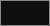
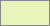
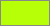

# Plantilla de diapositivas de la Python Brasil 2026

[Português](README.md) · [English](README.en.md) · Español

Una plantilla de presentación lista para quienes dan una charla en la [Python Brasil 2026](https://2026.pythonbrasil.org.br/), en Florianópolis, del 14 al 19 de octubre. La abres, cambias el texto de ejemplo por el tuyo y presentas. Las diapositivas de ejemplo y las notas están en portugués.

## Elige cómo vas a editar

| Usas | Haz esto |
|---|---|
| Google Slides | **[Hacer una copia en Google Slides](https://docs.google.com/presentation/d/1Wy1BdlDfRLMqblnBwGq42-O9-O1lEkB04zzoWlSeAUE/copy)**. La copia va a tu Google Drive. |
| PowerPoint o Keynote | Descarga el [`.pptx`](https://github.com/rodbv/pybr2026-slides/releases/latest/download/pybr2026-template.pptx) e [instala las fuentes](#necesito-instalar-fuentes). |
| LibreOffice | Descarga el [`.odp`](https://github.com/rodbv/pybr2026-slides/releases/latest/download/pybr2026-template.odp). Las fuentes ya vienen dentro del archivo. |
| Un editor de texto | Usa la [plantilla en Markdown](https://github.com/rodbv/pybr2026-marp), que también tiene diapositivas de ejemplo en español y en inglés. Escribes las diapositivas como texto y un agente de IA, como Copilot o Claude, aplica el estilo visual. |

Ver las 38 diapositivas a la vez

## Después de abrirla

Las diapositivas de ejemplo muestran cada diseño y tienen consejos en las notas. Usa los consejos que te sirvan.

1. Guarda una copia de la plantilla sin cambios, para consultar los consejos después.
2. En una segunda copia, con el nombre de tu charla, elige la versión oscura o la clara y borra la otra mitad.
3. Duplica las diapositivas que vas a usar y borra las demás. Para una diapositiva nueva, usa Diapositiva > Nueva diapositiva y elige el diseño.
4. Cambia el texto y las imágenes. Las cajas grises marcan el lugar de las imágenes: haz clic derecho y elige "Reemplazar imagen" ("Cambiar imagen" en PowerPoint).
5. Borra las notas de los ejemplos y escribe las tuyas.

Una charla de 25 minutos suele caber en 15 a 25 diapositivas: portada, agenda, una sección para cada parte, el contenido y el cierre, con unos 5 minutos para preguntas.

Antes de presentar, busca en el archivo lo que quedó de la plantilla: "Seu nome aqui", "@seu_usuario", "voce@exemplo.com.br", cajas grises, "Dados de exemplo" y "Troque pelo QR code".

La plantilla es un punto de partida: cambia lo que quieras. Para mantener el estilo del evento, usa los colores y las fuentes de abajo. El [resumen de la identidad visual](docs/referencia.md#identidade-visual) (en portugués) tiene el resto: logos, stickers y reglas de contraste.

## Colores y fuentes

| | Color | Hex | RGB | Uso |
|---|---|---|---|---|
|  | Negro | `#0F0F0F` | 15, 15, 15 | Fondo oscuro, texto sobre fondo claro |
|  | Blanco roto | `#E8F4BA` | 232, 244, 186 | Texto sobre fondo oscuro |
|  | Verde lima | `#B7FF06` | 183, 255, 6 | Destacado; como color de texto, solo sobre fondo oscuro |
|  | Violeta | `#BF2EB2` | 191, 46, 178 | Enlaces sobre fondo claro |

| Fuente | Uso |
|---|---|
| [Cascadia Mono](https://fonts.google.com/specimen/Cascadia+Mono) | Títulos y código |
| [Roboto](https://fonts.google.com/specimen/Roboto) | Texto |

¿Vas a crear material con un agente de IA? Pídele que lea el [`AGENTS.md`](AGENTS.md): el archivo tiene los colores, las fuentes y las reglas de la marca.

## Antes de presentar

¿Primera charla? Qué bien. El público de la Python Brasil está de tu lado, y estos consejos son sugerencias, no reglas.

- **Texto:** con 18 pt o más, quien se sienta al fondo de la sala también lee la diapositiva. Si el texto no cabe, divide la diapositiva en dos y pasa el resto a las notas.
- **Código:** hasta 8 líneas y unas 60 columnas por diapositiva. Si el fragmento es más largo, divídelo en varias diapositivas o muestra solo la parte que importa.
- **Enlace a tus diapositivas:** cambia el código QR del cierre por un código QR con el enlace a tus diapositivas. Escribe también el enlace debajo.
- **Preguntas:** reserva unos 5 minutos para preguntas. Repite cada pregunta en el micrófono antes de responder, para la sala y la grabación.
- **Live coding:** ten un plan B, como un video de la demo funcionando o capturas de pantalla de cada paso.
- **Internet:** con los videos, las páginas y los notebooks descargados, no dependes de la red del evento.
- **PDF:** exporta tus diapositivas en PDF y llévalo en un pendrive. El PDF abre en cualquier computadora, con las fuentes correctas. Google Slides: Archivo > Descargar > Documento PDF. PowerPoint: Archivo > Exportar. LibreOffice: Archivo > Exportar como > Exportar como PDF.

## Preguntas frecuentes

¿Necesito instalar fuentes?

Solo para el `.pptx`. Google Slides encuentra las fuentes por sí mismo y el `.odp` ya trae las fuentes dentro. La plantilla usa Roboto para el texto y Cascadia Mono para los títulos y el código; las dos están en la carpeta [`fonts/`](fonts/).

- **Windows:** selecciona los archivos `.ttf`, haz clic derecho y elige "Instalar".
- **macOS:** abre cada archivo `.ttf` y haz clic en "Instalar tipo de letra".
- **Linux:** copia los archivos `.ttf` a `~/.local/share/fonts/` y ejecuta `fc-cache -f`.

Sin las fuentes, el programa usa otra fuente. El texto sigue legible, pero los títulos pueden cortarse en lugares distintos.

¿Cómo cambio una imagen o el código QR?

Haz clic derecho en la caja gris o en el código QR y elige "Reemplazar imagen" ("Cambiar imagen" en PowerPoint). El tamaño escrito en la caja es el tamaño que llena el espacio en una pantalla Full HD.

Para crear el código QR en LibreOffice, usa Insertar > Objeto OLE > Código QR y de barras. En los otros programas, crea la imagen en un sitio de códigos QR. Prueba la lectura con el celular a unos metros de la pantalla.

¿Cómo pongo código con colores?

Los programas de presentación no colorean el código. Pega tu fragmento en [SlideSnippet](https://www.slidesnippet.com/) y elige el tema Monokai. Después:

- **Google Slides:** haz clic en "Copy styled" y pega en la tarjeta de la diapositiva "Código" con Editar > Pegar.
- **PowerPoint:** haz clic en "Copy styled" y pega con "Mantener formato de origen".
- **LibreOffice:** haz clic en "Download SVG" y arrastra el archivo a la tarjeta.

La [referencia](docs/referencia.md#código-nos-slides) (en portugués) tiene todas las opciones.

¿Cómo cambio los datos del gráfico?

- **PowerPoint:** haz clic derecho en el gráfico y elige "Editar datos".
- **LibreOffice:** haz doble clic en el gráfico y usa Ver > Tabla de datos.
- **Google Slides:** la importación convierte el gráfico en imagen. Crea el tuyo con Insertar > Gráfico.

## ¿Encontraste un problema?

Abre un [issue en GitHub](https://github.com/rodbv/pybr2026-slides/issues). Cuenta qué pasó y en qué programa, y agrega una captura de pantalla si puedes.

## Más información

Estas páginas están en portugués:

- [Referencia](docs/referencia.md): diseños, colores y contraste, identidad visual, accesibilidad y código en las diapositivas.
- [Cómo contribuir](CONTRIBUTING.md): cómo se genera y se publica la plantilla.

## Licencias

- Plantilla, textos de ejemplo y código de este repositorio: [CC0 1.0](LICENSE) (dominio público). Úsalos, cámbialos y compártelos sin pedir permiso ni dar crédito.
- Logo, ilustraciones e identidad visual: Python Brasil 2026 y APyB, del brandboard oficial del evento, creado por [Ana Terhorst](https://anaterhorstdesign.com).
- Fuentes Roboto y Cascadia Mono: SIL Open Font License 1.1, en `fonts/`.
