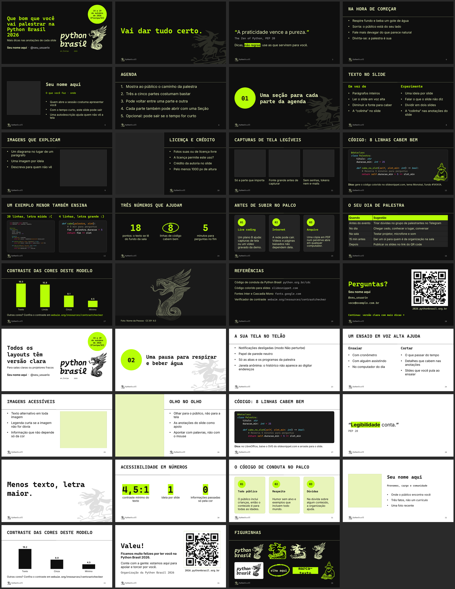

# Modelo de slides da Python Brasil 2026

Modelo de apresentação para palestrantes e organização da [Python Brasil 2026](https://2026.pythonbrasil.org.br/), em Florianópolis, de 14 a 19 de outubro de 2026. Funciona no LibreOffice Impress, no Google Slides e no PowerPoint, em Linux, macOS e Windows.



## Usar no Google Slides

**[Fazer uma cópia no Google Slides](https://docs.google.com/presentation/d/1IIdQNW3mwgIDROzhOyWOpeeAarsza7Ljb_2SUg4gcZ0/copy)**

O link cria uma cópia editável no seu Google Drive, com todos os layouts. Não precisa baixar nada nem instalar fontes.

## Baixar

| Arquivo | Para |
|---|---|
| [`dist/pybr2026-template.odp`](dist/pybr2026-template.odp) | LibreOffice e OpenOffice |
| [`dist/pybr2026-template.pptx`](dist/pybr2026-template.pptx) | PowerPoint, Keynote e também LibreOffice |

Os dois arquivos têm o mesmo conteúdo. O `.odp` foi gerado pelo LibreOffice a partir do `.pptx` e leva as fontes dentro do arquivo: abre certo mesmo sem as fontes instaladas.

## Fontes

O modelo usa duas fontes livres, as mesmas do site do evento:

- **Inter** para texto
- **Cascadia Mono** para títulos e código

Instale as duas antes de abrir o arquivo; elas estão na pasta [`fonts/`](fonts/) com suas licenças (SIL Open Font License).

- **Linux:** copie os `.ttf` para `~/.local/share/fonts/` e rode `fc-cache -f`.
- **macOS:** abra cada `.ttf` e clique em "Instalar fonte", ou copie para `~/Library/Fonts/`.
- **Windows:** selecione os `.ttf`, botão direito, "Instalar".
- **Google Slides:** nada a instalar. As duas fontes existem no Google Fonts e o Slides as encontra pelo nome na importação.

O `.odp` já traz as duas fontes embutidas. No `.pptx`, sem as fontes instaladas, o programa substitui por outra fonte e os títulos podem quebrar em lugares diferentes. O texto continua legível.

## Como usar

Cada slide do arquivo mostra um layout preenchido com texto de exemplo. O arquivo tem duas seções: layouts escuros e layouts claros. Os comentários do apresentador (notas) de cada slide explicam para que o layout serve.

1. Abra o arquivo e salve uma cópia com o nome da sua palestra.
2. Duplique os slides que você vai usar e apague os outros.
3. Para criar um slide novo a partir de um layout: Slide > Novo slide, depois escolha o layout no painel lateral (LibreOffice: "Propriedades > Layouts"; Google Slides e PowerPoint: botão "Layout").

### Google Slides

Use o link "Fazer uma cópia" no topo desta página. Os layouts, as cores do tema e as fontes vêm junto.

O Google Slides converte o gráfico do slide "Gráfico nativo" em imagem, e o eixo perde os rótulos. Para um gráfico editável no Slides, use Inserir > Gráfico.

### Imagens

Os espaços para imagem são caixas com borda fina, com o texto "Clique no ícone ou arraste uma imagem". No PowerPoint e no Google Slides, clique no ícone dentro da caixa para escolher a imagem. No LibreOffice, insira a imagem (Inserir > Imagem) e arraste-a sobre a caixa; apague a caixa depois. No slide "Imagem cheia", clique com o botão direito na imagem de exemplo e escolha "Substituir imagem".

O QR code do encerramento leva ao site do evento. Para trocar: no LibreOffice, Inserir > Objeto > Código QR e de barras; no Google Slides e no PowerPoint, gere a imagem num gerador de QR code e use "Substituir imagem". Escreva o link embaixo do QR code também e teste a leitura com o celular a alguns metros da tela.

## Antes de apresentar

- **Texto:** quem senta no fundo da sala precisa ler o slide também. O texto do modelo começa em 20 pt e diminui sozinho até caber; se ele diminuir, divida o slide em dois. Nada abaixo de 18 pt. O slide apoia a sua fala; o que não couber vai para as notas do apresentador.
- **Código:** até 8 linhas e cerca de 60 colunas por slide. Se o trecho for maior, divida em mais slides ou refatore o exemplo para mostrar só o que importa: 20 linhas pequenas ninguém lê do fundo da sala.
- **Link dos slides:** mostre um QR code no encerramento. Ninguém copia um link da tela, mas todo mundo aponta o celular. Aponte o QR code para um lugar só, com slides, código e contatos.
- **Perguntas:** reserve uns 5 minutos do seu horário para perguntas e combine com quem modera como avisar o fim do tempo. Repita cada pergunta no microfone antes de responder: a sala e a gravação não ouvem quem perguntou.
- **Sobre você:** quem abre a sessão costuma apresentar você antes da palestra. Se o tempo estiver curto, o slide "Sobre mim" pode sair, ou virar uma linha na capa.
- **Live coding:** tenha um plano B. Grave um vídeo da demo funcionando ou capture telas de cada passo, e deixe os arquivos no computador. Se algo falhar no palco, você troca para a gravação e segue.
- **Internet:** a rede do evento pode cair ou ficar lenta com centenas de pessoas conectadas. Baixe os vídeos, as páginas e os notebooks que vai mostrar; não dependa de streaming nem de demos online.
- **Arquivo:** leve uma cópia dos slides em PDF num pendrive, com os vídeos e as imagens juntos. O PDF abre em qualquer computador, com as fontes certas.

## Layouts

Todos existem em versão escura e clara, exceto a imagem cheia, que é só escura.

| Layout | Para |
|---|---|
| Capa | Título da palestra em até três linhas, subtítulo, nome e handle, com o selo da data |
| Agenda | Lista numerada de três a cinco partes da palestra |
| Seção | Divisor com número no disco limão e o dragão ao fundo |
| Título e conteúdo | Tópicos; de três a cinco por slide |
| Duas colunas | Comparações com título em cada coluna: antes e depois, problema e solução |
| Texto e imagem | Texto à esquerda, imagem à direita |
| Imagem e texto | Imagem sangrada à esquerda, texto à direita |
| Três imagens | Três capturas de tela lado a lado, cada uma com legenda |
| Código | Cartão escuro com até 8 linhas e 60 colunas de código a 15 pt |
| Código lado a lado | Dois cartões de código, antes e depois, com até 8 linhas e 30 colunas cada |
| Citação | Frase em destaque com autoria |
| Frase | Uma frase só, grande, para a ideia principal ou para mudar de assunto |
| Números em destaque | Três números grandes com rótulo; cabem valores como "1.200" ou "R$ 3,5 mi" |
| Três cartões | Três blocos com título e descrição |
| Palestrante | Foto, nome, cargo e três fatos |
| Somente título | Espaço livre para tabelas, gráficos e diagramas |
| Imagem cheia | Foto de fundo com faixa de legenda |
| Referências | Um material por linha, com nome e endereço curto |
| Encerramento | "Obrigado!" ou "Perguntas?", contatos e um QR code grande com o link dos slides |
| Em branco | Só o logo e o número do slide |

## Cores e contraste

Todas as combinações de texto e fundo usadas no modelo passam no nível AA do WCAG 2.1 (contraste mínimo de 4,5:1 para texto normal). As principais passam no AAA.

| Uso | Cor | Sobre | Contraste |
|---|---|---|---|
| Fundo escuro | `#0F0F0F` | | |
| Texto no escuro | `#F0F8FF` | `#0F0F0F` | 17,9:1 |
| Destaque no escuro (limão) | `#B7FF06` | `#0F0F0F` | 15,8:1 |
| Roxo no escuro | `#C95FB4` | `#0F0F0F` | 5,3:1 |
| Texto secundário no escuro | `#A8A8A8` | `#0F0F0F` | 7,3:1 |
| Cartões no escuro | `#242424`, borda `#3A3A3A` | | |
| Texto em cartão escuro | `#F0F8FF` | `#242424` | 14,5:1 |
| Fundo claro | `#FFFFFF` | | |
| Texto no claro | `#0F0F0F` | `#FFFFFF` | 19,2:1 |
| Destaque no claro (oliva) | `#3F6300` | `#FFFFFF` | 7,0:1 |
| Roxo no claro (ameixa) | `#7A2F6B` | `#FFFFFF` | 8,6:1 |
| Texto secundário no claro | `#4A4A4A` | `#FFFFFF` | 8,9:1 |
| Cartões no claro | `#E8F4BA`, borda `#C9D9A0` | | |
| Destaque em cartão claro (oliva) | `#3F6300` | `#E8F4BA` | 6,0:1 |
| Texto sobre disco limão | `#0F0F0F` | `#B7FF06` | 15,8:1 |

Duas regras para manter o contraste quando você editar:

- Verde limão `#B7FF06` como cor de texto, só sobre fundo escuro. Sobre fundo branco o contraste é 1,2:1 e o texto some. No fundo claro, o texto em destaque é oliva `#3F6300`.
- Os discos limão aparecem nos dois modos, sempre com texto preto `#0F0F0F`.
- Cartões e espaços para imagem têm borda fina: só a cor de fundo deles fica a 1,1:1 do fundo do slide e some em projetor fraco.

As cores estão no tema do arquivo. Se você trocar uma cor do tema (LibreOffice: Slide > Mestre; PowerPoint: Exibir > Slide mestre > Cores), todos os slides mudam juntos.

## Acessibilidade

- Tamanhos: 20 pt no corpo (diminui até caber, nunca abaixo de 18 pt), 18 pt em cartões e rótulos, 15 pt no código, 32 pt nos títulos. O slide tem 10 polegadas de largura, então 20 pt aqui equivalem a 27 pt num slide widescreen padrão de 13,33 polegadas.
- Idioma do texto marcado como português do Brasil, para leitores de tela e corretor ortográfico.
- Todas as caixas de texto são texto de verdade, não imagem, com exceção do logo e do dragão.
- As imagens de exemplo têm texto alternativo; ao inserir as suas, preencha o texto alternativo (botão direito > Descrição ou Texto alternativo).
- Os espaços reservados têm nomes (`title`, `body`, `code`), o que ajuda a navegação por teclado e a ordem de leitura.

## Código nos slides

O modelo usa o tema **Monokai** para código. O verde-limão e o magenta do Monokai combinam com o limão e o roxo da Python Brasil, e todas as cores do tema passam no contraste AA sobre o cartão escuro (`#1A1A1A`).

Os programas de apresentação não colorem código. Para ter as mesmas cores no seu trecho, use o [SlideSnippet](https://www.slidesnippet.com/) com estas opções:

| Opção | Valor |
|---|---|
| Theme | Monokai |
| Font size | 20px (15 pt no slide) |
| Line height | 1.2 |
| Background | `#1A1A1A` (RGB 26, 26, 26) |

Depois, conforme o programa:

- **Google Slides:** escolha "Optimised for: Google Slides / Docs" e clique em "Copy styled". Clique dentro do cartão do slide "Código" e cole pelo menu Editar > Colar; o Ctrl+V pode perder as cores. O código continua editável.
- **PowerPoint:** escolha "Optimised for: PowerPoint / Word", clique em "Copy styled" e cole com "Manter formatação original".
- **LibreOffice:** o LibreOffice perde as cores ao colar texto do navegador. Clique em "Download SVG" e arraste o arquivo para o slide, sobre o cartão. O SVG fica nítido em qualquer tamanho. Para código editável, instale a extensão [Code Highlighter 2](https://extensions.libreoffice.org/en/extensions/show/5814) e escolha o estilo `monokai`.

Quando o código entrar como imagem, escreva o código no texto alternativo (botão direito > Descrição no LibreOffice, Texto alternativo no Google Slides e no PowerPoint), para leitores de tela.

O cartão aceita até 8 linhas de 15 pt.

## Gerar os arquivos de novo

O `.pptx` é gerado por um script Node com [pptxgenjs](https://gitbrent.github.io/PptxGenJS/). Edite `pptx/build.js` para mudar layouts, cores ou textos de exemplo.

```sh
npm install
npm run build     # escreve dist/pybr2026-template.pptx
npm run render    # PDF, PNGs em dist/preview/ e dist/pybr2026-template.odp (precisa de LibreOffice, poppler e ImageMagick)
```

A paleta e as fontes ficam no objeto `THEME` no topo de `pptx/build.js`. O arquivo `pptx/lib/theme.js` grava essas cores no tema do `.pptx`; `pptx/lib/highlight.js` colore o código de exemplo.

A cópia no Google Slides não é atualizada pelo script. Depois de mudar o `.pptx`, envie o arquivo para o Drive, abra e escolha Arquivo > Salvar como Apresentações Google, compartilhe como "Qualquer pessoa com o link: Leitor" e troque o ID no link "Fazer uma cópia" deste README.

## Licenças

- Código deste repositório: MIT.
- Logo, dragão e identidade visual: Python Brasil 2026 e APyB, vindos do [site oficial](https://github.com/pythonbrasil/pybr2026-site).
- Fontes Inter e Cascadia Mono: SIL Open Font License 1.1, em `fonts/`.
